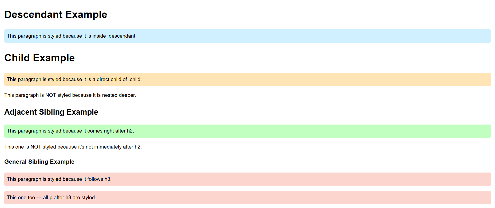

#  CSS Combinators Example

This repository demonstrates the **application of CSS combinators** in a single HTML file — without external CSS or JavaScript.

---

##  Description

This HTML file shows how different CSS combinators affect element selection and styling.  
Each combinator is applied using internal CSS and visualized through background color changes — no explanations or labels appear on the webpage.

---

## CSS Combinators Used

| Combinator | Selector Example | Description |
|-------------|------------------|--------------|
| **Descendant (space)** | `.descendant p` | Selects all `
` elements inside `.descendant`, at any level. |
| **Child (>)** | `.child > p` | Selects only `
` elements that are direct children of `.child`. |
| **Adjacent Sibling (+)** | `h2 + p` | Selects the first `
` immediately after an `<h2>`. |
| **General Sibling (~)** | `.general h3 ~ p` | Selects all `
` elements that follow an `<h3>` inside `.general`. |

---

##  How to View

1. Open the `combinators.html` file in any browser.  
2. Observe how paragraphs are styled differently based on their relationship in the HTML structure.  
3. The output shows only styling effects — no explanatory text appears in the page.

---

## Output

##  Created For

Learning and practicing **CSS combinator selectors** through direct visual examples.

---

## 🪪 License

This is a free educational example — you may use or modify it freely.
