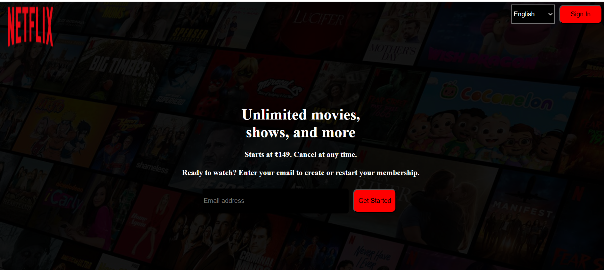

# 🎬 Netflix Landing Page Clone

This project is a simple **Netflix homepage clone** built using HTML and CSS.  
It recreates the look and feel of Netflix’s landing page for learning and practice purposes.

---

## 📁 Project Structure
netflix/
│
├── netflix.html # Main HTML file
├── style.css # CSS styling file
└── README.md # Project documentation


---

## 💡 Features
- Responsive Netflix-style layout  
- Language selection dropdown  
- Sign-in button  
- Email form for membership start  
- Background and section styling with CSS  

---

## 🚀 How to Run
1. Clone this repository:
   ```bash
   git clone https://github.com/Divyakake03/netflix.git```

2. Open the project folder:

    cd netflix

3. Open netflix.html in your browser.

## Technologies Used

### HTML5
### CSS3

## 📸 Preview
